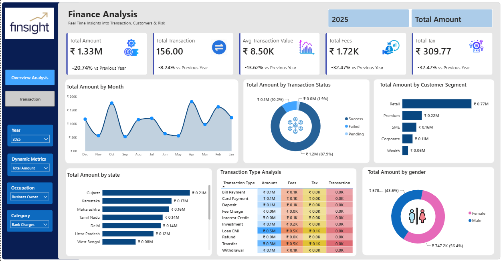
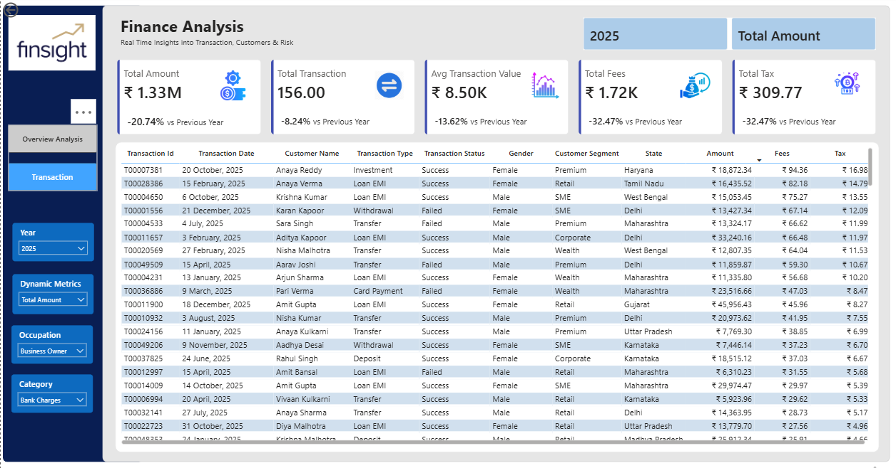

# Finance Analytics Dashboard | Power BI

## Project Overview
This project is an interactive Finance Analytics Dashboard developed in Power BI. It helps stakeholders monitor transaction performance, customer behavior, fees, taxes, and financial trends across segments and regions.

## Business Objective
The dashboard centralizes financial transaction analysis to support better business decisions. It enables users to track KPIs, identify high-performing customer segments and states, analyze transaction patterns, and understand demographic contributions.

## Key KPIs
- Total Transaction Amount
- Total Transactions
- Average Transaction Value
- Total Fees
- Total Tax
- Year-over-Year Growth

## Dashboard Insights
- Monthly transaction amount trends
- Transaction status analysis: Success, Failed, and Pending
- Customer segment contribution
- State-wise transaction performance
- Transaction type analysis using Amount, Fees, Tax, and Transaction Count
- Gender-based transaction analysis
- Detailed drill-down view for underlying transaction records

## Filters Used
- Year
- Dynamic Measure
- Occupation
- Category

## Tools and Skills
- Power BI
- Power Query
- DAX
- Data Cleaning and Transformation
- Data Modeling
- Data Visualization
- Financial Analysis

## Dashboard Preview

## Project Files
- `Finance_Analytics_Dashboard.pbix` - Power BI dashboard file
- `images/` - Dashboard screenshots
- `data/` - Sample or anonymized data, if shareable

## Author
**Abhishek Holkar**  
Aspiring Finance / Data Analyst  
[LinkedIn](www.linkedin.com/in/abhishek-holkar-989893259)
